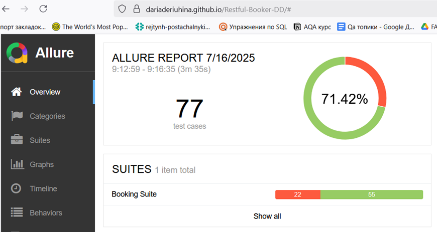
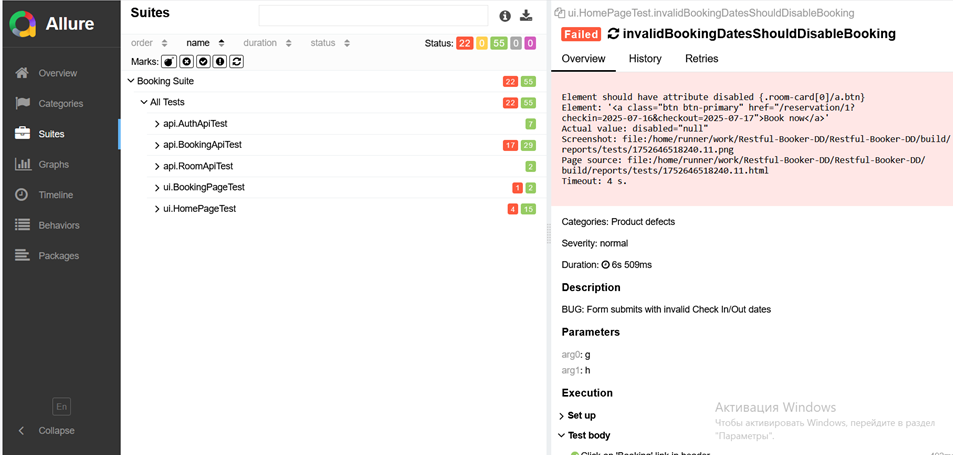

# Restful-Booker Test Automation

UI and API automation project for [automationintesting.online](https://automationintesting.online/) built with **Java**, **Selenide**, **RestAssured**, and **TestNG**.

## Technologies

- Java 17
- Selenide
- RestAssured
- TestNG
- Allure
- Maven
- Selenium Grid
- Docker

## Configuration

Edit `src/main/resources/env.properties`:

```properties
baseUrl=https://automationintesting.online/
remoteUrl=http://localhost:4444/wd/hub
seleniumUrl=http://localhost:4444/wd/hub/status
bookingUrl=https://automationintesting.online/reservation/%d?checkin=%s&checkout=%s
username=admin
password=password
```

You can override settings via system properties or environment variables:
```bash
mvn test -Dusername=myuser -Dpassword=mypass
```

## How to Run

### Local (UI)
```bash
mvn clean test -DbrowserName=chrome -Dheadless=false -DrunMode=local
```

### Remote (Selenium Grid)
```bash
make sure Docker Desktop is running

# Run tests
mvn clean test -DbrowserName=chrome -Dheadless=true -DrunMode=remote

# Stop Grid
docker compose down
```

### Test Groups
- `API` - API tests only
- `UI` - UI tests only
- `REGRESSION` - All regression tests

## Reports

**Latest CI Report:** https://dariaderiuhina.github.io/Restful-Booker-DD/



## Known Bugs

These are **real bugs** found during testing:

**API:**
- Booking accepts past dates (`BookingApiTest.bookingInPastShouldBeRejectedTest`)
- SQL injection vulnerability (`BookingApiTest.sqlInjectionBookingFormTest`)

**UI:**
- Invalid dates don't disable booking (`HomePageTest.invalidBookingDatesShouldDisableBooking`)
- Double-click causes JS error (`BookingPageTest.doubleClickReserveNowTest`)
- Header navigation scrolling issues (`HomePageTest.scrollToSectionsByHeaderTest`)

## Project Structure

```
src/
├── main/java/
│   ├── api/          # API client, models, services
│   ├── ui/           # Page objects, components  
│   └── utils/        # Utilities, config
└── test/java/
    ├── api/          # API tests
    ├── ui/           # UI tests
    └── testdata/     # Test data providers
```

## Requirements

- Java 17+
- Maven 3.8+
- Docker (for remote execution)