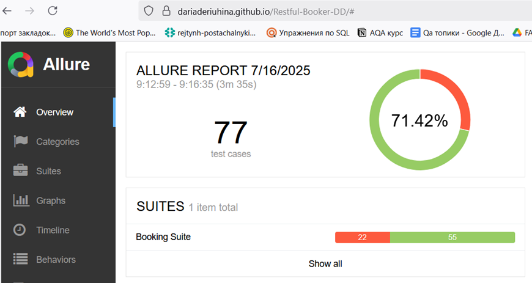
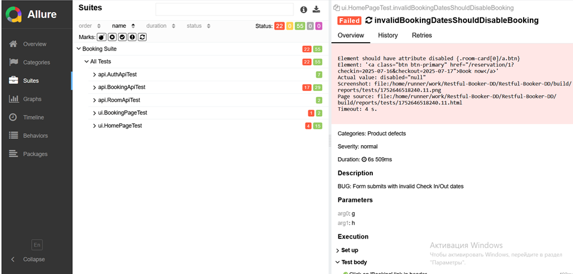

# Restful-Booker-DD

UI and API automation project for [automationintesting.online](https://automationintesting.online/) built with **Java**, **Selenide**, **Rest Assured**, and **TestNG**.

---

## ✨ Overview

This project tests both the **API and UI** of the Restful-Booker platform. The framework is designed to be scalable, readable, and CI/CD-friendly.

---

## 🌐 Technologies Used

* Java 18
* Selenide
* Rest Assured
* TestNG
* Allure for reporting
* Maven
* GitHub Actions (CI)
* Selenium Grid
* Docker Desktop (required for remote UI run)

## ⚙️ How to Run Tests

### ✅ Local Run (UI)

1. Run tests locally with the following parameters:

```bash
mvn clean test \
  -ea \
  -DbrowserName=chrome \
  -Dheadless=false \
  -DrunMode=local
```

### 🌐 Remote Run via Selenium Grid

1. Make sure Docker Desktop is installed.
2. Ensure Docker Desktop is running.
3. Run tests remotely:

```bash
mvn clean test \
  -ea \
  -DbrowserName=chrome \
  -Dheadless=true \
  -DrunMode=remote
```

---

## 🏃 GitHub Actions (CI)

Tests run in a Selenium Grid environment powered by Selenoid and Docker.

---

## 🔬 Allure Report

View the latest Allure report from CI:

https://dariaderiuhina.github.io/Restful-Booker-DD/





The failed tests are known bugs — you can find their descriptions in the README section below.

---

## 🌟 Features Covered (UI)

* Booking creation and confirmation
* Date picker and dynamic calendar handling
* Form validation (empty fields, incorrect input)
* Contact form scenarios
* Room filtering and listing
* Navigation and UI interactions

## 🌟 Known Bugs

BUG #1: Form submits with invalid Check In/Out dates: dates in the past (both UI/API level)
BookingApiTest.bookingInPastShouldBeRejectedTest
BookingFormUiTest.invalidBookingDatesShouldDisableBooking

BUG #2: Form submits with invalid Check In/Out dates: check-in date after check-out date (both UI/API level)
BookingFormUiTest.invalidBookingDatesShouldDisableBooking

BUG #3: Date picker allows to select past dates
BookingFormUiTest.invalidBookingDatesShouldDisableBooking

BUG #4: Double-click on 'Reserve Now' triggers client-side error due to race condition (JavaScript crash)
BookingFormUiTest.doubleClickReserveNowTest

BUG #5: Clicking on "Rooms" or "Contact" tabs does not scroll to the corresponding section reliably
HomePageTest

BUG #6: Room cards sometimes overlap when window is resized, causing layout issues

BUG #7: API should not accept dangerous payloads in booking form fields (e.g., SQL injection strings)
BookingApiTest.sqlInjectionBookingFormTest